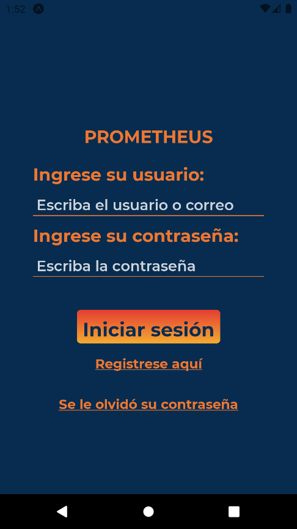
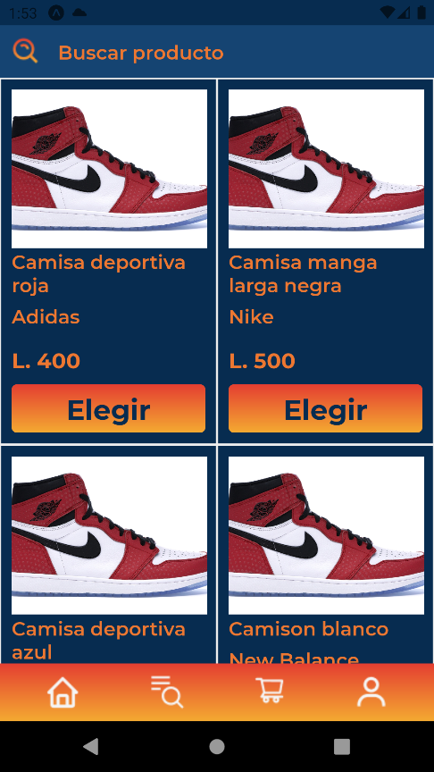

# Prometheus Client App
This is an API made for the Mobile Programming 2 class. This is the first API I made and it introduced me to this new world. This project was made by a team of three people led by me. This API was made for a fictitious store that sells sportswear called Prometheus.

## Description

This project was developed with Javascript, React Native and Expo.

This mobile application has to be connected to an API that was made by this same team in order to store and collect data and information from the MySQL database running locally. A similar application was also made for the store clerk, in which he or she could add new products, replenish inventory, and delete or modify items on sale. Here are the links to the other repositories:
- [API Prometheus](https://github.com/Bryanmartz972/ProyectoMovil2)
- [Mobile employee app](https://github.com/Bryanmartz972/ProyectoMovil2ReactEmpleado)

## Installation

To install the project on the computer, clone the repository or download the .zip folder and extract it to any other folder. Once you have the project, in the Visual Studio Code terminal or in another terminal, run the following commands:

```bash
  npm i
  expo start
```

To test the project:

- The API must be running before the application
- You have to change the IP address in any file that presents another IP address

When all that is changed, you can open the application through the "Expo Go" application on your cell phone and connect it through the QR code by appearing in the terminal when running the project.
## Features

- 👤 Login and Signup
- 💰 Buy products from app
- 🔎 Search and filters of products
- 🛒 Shopping cart
## Tech Stack

- ⚛️ React Native
- 📱 Expo
- ✖️ Axios


## Screenshots





## Authors

Here are the GitHub profiles of the team members (including me) who made this API a reality:

- [@Bryanmartz972](https://github.com/Bryanmartz972) 
- [@Otoniel18a](https://github.com/Otoniel18a)
- [@Lizzi-Alonzo](https://github.com/Lizzi-Alonzo)
